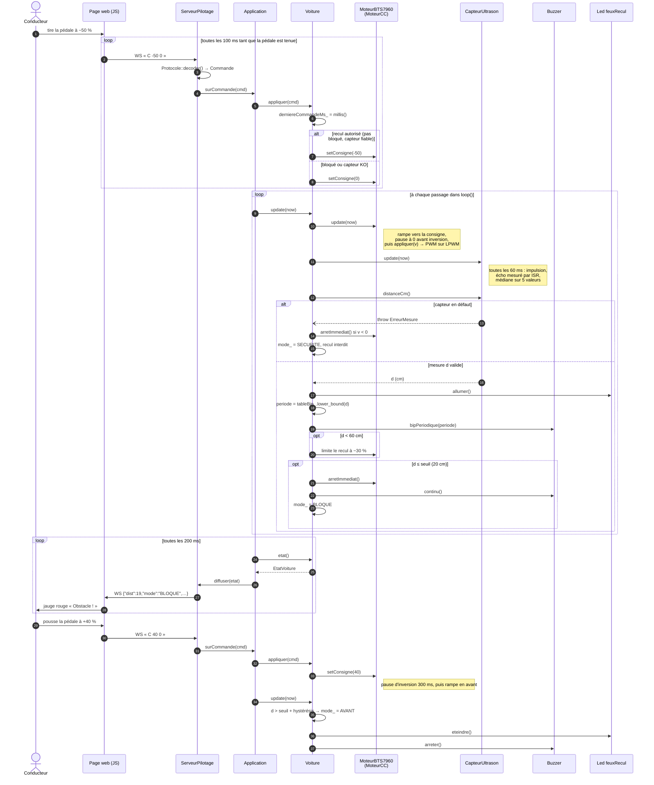

# Diagramme de séquence : marche arrière avec obstacle (S3)

Tout se passe dans `loop()`, sans rien qui bloque. Seule la fin de l'écho ultrason arrive par interruption.

```mermaid
sequenceDiagram
    autonumber
    actor C as Conducteur
    participant P as Page web (JS)
    participant S as ServeurPilotage
    participant A as Application
    participant V as Voiture
    participant M as MoteurBTS7960<br/>(MoteurCC)
    participant U as CapteurUltrason
    participant B as Buzzer
    participant F as Led feuxRecul

    C->>P: tire la pédale à −50 %
    loop toutes les 100 ms tant que la pédale est tenue
        P->>S: WS « C -50 0 »
        S->>S: Protocole::decoder() → Commande
        S->>A: surCommande(cmd)
        A->>V: appliquer(cmd)
        V->>V: derniereCommandeMs_ = millis()
        alt recul autorisé (pas bloqué, capteur fiable)
            V->>M: setConsigne(-50)
        else bloqué ou capteur KO
            V->>M: setConsigne(0)
        end
    end

    loop à chaque passage dans loop()
        A->>V: update(now)
        V->>M: update(now)
        Note right of M: rampe vers la consigne,<br/>pause à 0 avant inversion,<br/>puis appliquer(v) → PWM sur LPWM
        V->>U: update(now)
        Note right of U: toutes les 60 ms : impulsion,<br/>écho mesuré par ISR,<br/>médiane sur 5 valeurs
        V->>U: distanceCm()
        alt capteur en défaut
            U--)V: throw ErreurMesure
            V->>M: arretImmediat() si v < 0
            V->>V: mode_ = SECURITE, recul interdit
        else mesure d valide
            U-->>V: d (cm)
            V->>F: allumer()
            V->>V: periode = tableBip_.lower_bound(d)
            V->>B: bipPeriodique(periode)
            opt d < 60 cm
                V->>M: limite le recul à −30 %
            end
            opt d ≤ seuil (20 cm)
                V->>M: arretImmediat()
                V->>B: continu()
                V->>V: mode_ = BLOQUE
            end
        end
    end

    loop toutes les 200 ms
        A->>V: etat()
        V-->>A: EtatVoiture
        A->>S: diffuser(etat)
        S->>P: WS {"dist":19,"mode":"BLOQUE",…}
        P->>C: jauge rouge « Obstacle ! »
    end

    C->>P: pousse la pédale à +40 %
    P->>S: WS « C 40 0 »
    S->>A: surCommande(cmd)
    A->>V: appliquer(cmd)
    V->>M: setConsigne(40)
    Note right of M: pause d'inversion 300 ms, puis rampe en avant
    A->>V: update(now)
    V->>V: d > seuil + hystérésis → mode_ = AVANT
    V->>F: eteindre()
    V->>B: arreter()
```
